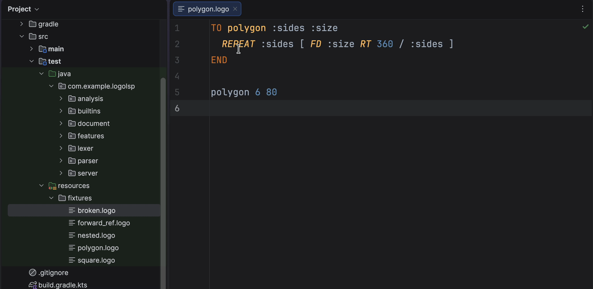
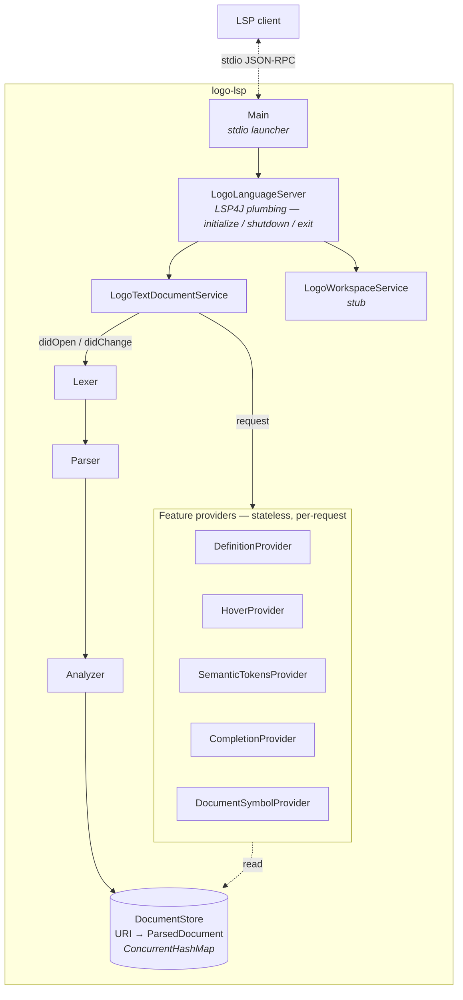

# logo-lsp

A production-grade [Language Server Protocol](https://microsoft.github.io/language-server-protocol/)
implementation for the [Turtle Academy](https://turtleacademy.com/) dialect of LOGO.
Speaks LSP over stdio (default) or a TCP socket; designed for
[LSP4IJ](https://github.com/redhat-developer/lsp4ij) in JetBrains IDEs and works with
any generic LSP client.

[](https://openjdk.org/projects/jdk/17/)
[](https://gradle.org)
[](https://github.com/eclipse-lsp4j/lsp4j)
[](https://junit.org/junit5/)
[](#tests)



---

## Contents

- [Features](#features)
- [Quick start](#quick-start)
- [LSP4IJ integration](#lsp4ij-integration)
- [Architecture](#architecture)
- [Project layout](#project-layout)
- [Design decisions](#design-decisions)
- [Tests](#tests)
- [Known limitations](#known-limitations)
- [Turtle Academy references](#turtle-academy-references)

---

## Features

| Capability | Status | Notes |
|---|---|---|
| Semantic-token highlighting | Implemented | Keywords, builtins, user procedures, parameters, locals, numbers, operators, comments |
| Go-to-definition | Implemented | User-defined procedures and variables (`:var`, parameter, `LOCAL`, `MAKE`) |
| Diagnostics | Implemented | Syntax errors, missing `END`, arity mismatches, duplicate procedure / parameter, unknown procedure, undefined variable, unused parameter / local (warnings) |
| Completion | Implemented | Context-aware: `:` triggers in-scope variables only; elsewhere, keywords + builtins + user procedures |
| Hover | Implemented | Builtin signatures with docs; user procs with any contiguous `;`-prefixed comment block above the `TO` lifted in as a doc comment |
| Document symbols | Implemented | Outline view of every `TO` block, parameters as children |
| Find-references | Deferred | See [Known limitations](#known-limitations) |
| Rename | Deferred | Builds on find-references |

---

## Quick start

Requires JDK 17+. The included Gradle wrapper installs everything else.

```sh
./gradlew shadowJar
```

Produces a single runnable fat jar at `build/libs/logo-lsp.jar`.

| Mode | Command | When to use |
|---|---|---|
| **stdio** (default) | `java -jar build/libs/logo-lsp.jar` | What LSP4IJ and most LSP clients use |
| **TCP socket** | `java -jar build/libs/logo-lsp.jar --socket 2087` | Attaching a debugger or driving from an integration test (listens on `127.0.0.1:<port>`, accepts a single connection) |

All logging is routed to **stderr**; stdout is reserved for LSP's JSON-RPC framing.

---

## LSP4IJ integration

1. Install the [**LSP4IJ**](https://plugins.jetbrains.com/plugin/23257-lsp4ij) plugin
   from the JetBrains Marketplace (Settings → Plugins → Marketplace → "LSP4IJ").
2. Open **Settings → Languages & Frameworks → Language Servers** (added by LSP4IJ).
3. Click **+ New Language Server**:
   - **Name:** `logo-lsp`
   - **Command:** `java -jar <absolute-path-to-logo-lsp.jar>` — LSP4IJ does not
     expand `$VARS`, `~`, or relative paths. From this repo's root,
     `echo "$(pwd)/build/libs/logo-lsp.jar"` prints the value to drop in.
   - **Mappings → File name patterns:** `*.logo`
4. Open any `*.logo` file. The server starts automatically; its stderr appears in
   the LSP Console tool window.

The same jar works with any generic-LSP client (VS Code's generic LSP extension,
Neovim's `nvim-lspconfig`, Emacs `lsp-mode`, …).

A full feature-by-feature walk-through with expected behaviour lives in
[`docs/manual-test.md`](docs/manual-test.md).

---

## Architecture



Diagnostics aren't a separate provider — the parser and analyzer collect them as they
build the `ParsedDocument`, and the document service pushes them via
`LanguageClient.publishDiagnostics()` on every `didOpen` / `didChange`.

**Invariants:**

- `ParsedDocument` is immutable; every field is derived from the text.
- Full reparse on every `didChange`. LOGO files are small; incremental parsing isn't
  worth the complexity.
- Feature providers are stateless. They take `(ParsedDocument, params, CancelChecker)`
  and return LSP types — trivially unit-testable, thread-safe, and cooperate with
  LSP cancellation. Long AST walks check `checker.checkCanceled()` between recursions
  so superseded requests abort instead of running to completion.
- Parser recovers at `NEWLINE` / `END` / `TO` / `]`; it never throws.
- Built-in primitives are *data*, loaded from `builtins.json`.

---

## Project layout

```
logo-lsp/
├── build.gradle.kts, settings.gradle.kts  # Kotlin DSL + Shadow plugin
├── gradle/ gradlew, gradlew.bat            # Gradle 8.10 wrapper
├── README.md                               # this file
├── docs/
│   ├── demo.gif                            # README demo capture
│   └── manual-test.md                      # manual LSP4IJ checklist
└── src/
    ├── main/java/com/example/logolsp/
    │   ├── Main.java                        # stdio + --socket launcher
    │   ├── server/
    │   │   ├── LogoLanguageServer.java
    │   │   ├── LogoTextDocumentService.java
    │   │   └── LogoWorkspaceService.java
    │   ├── document/
    │   │   ├── DocumentStore.java           # thread-safe URI → ParsedDocument
    │   │   └── ParsedDocument.java
    │   ├── lexer/
    │   │   ├── Token.java, TokenType.java
    │   │   └── LogoLexer.java
    │   ├── parser/
    │   │   ├── LogoParser.java              # recursive-descent, error-recovering
    │   │   ├── LogoKeywords.java            # canonical {TO, END} set
    │   │   ├── ParseResult.java
    │   │   └── ast/Ast.java                 # sealed hierarchy, 16 node types
    │   ├── analysis/
    │   │   ├── Symbol.java, Scope.java
    │   │   ├── SymbolTable.java
    │   │   └── Analyzer.java
    │   ├── builtins/
    │   │   └── LogoBuiltins.java            # loads builtins.json via Gson
    │   ├── features/
    │   │   ├── DefinitionProvider.java
    │   │   ├── SemanticTokensProvider.java
    │   │   ├── CompletionProvider.java
    │   │   ├── HoverProvider.java
    │   │   └── DocumentSymbolProvider.java
    │   └── util/
    │       ├── Ranges.java                  # half-open LSP range containment
    │       └── Names.java                   # sigil-stripping for :var / "word
    ├── main/resources/
    │   └── builtins.json                    # Turtle-Academy-consistent primitives
    └── test/
        ├── java/...                         # JUnit 5 + AssertJ (mirrors main tree)
        └── resources/fixtures/*.logo        # programs that paste-run in the playground
```

---

## Design decisions

The choices that shape the rest of the codebase.

- **Java 17, pure Java** (no Kotlin). Reads like LSP4J's own codebase, minimising
  cognitive overhead for the reviewer. Records + sealed interfaces give ergonomic
  immutable AST value types without Kotlin-specific build quirks.
- **Hand-written recursive-descent parser** (no ANTLR / JavaCC). The Kotlin compiler
  and IntelliJ PSI are both hand-written for exactly this reason: LSPs parse
  half-typed input, so graceful error recovery beats a terse generator grammar.
  LOGO is small enough that a hand-written parser fits in one focused file with
  precisely-tuned error messages.
- **Two-pass parser.** Pass 1 scans every `TO` header into an arity table; pass 2
  uses the combined builtins + user arity map to consume the right number of
  arguments per call. This is what lets forward references work — a call to `foo`
  before `TO foo … END` has been seen still parses correctly.
- **Full reparse on `didChange`.** The `ParsedDocument` is immutable; every change
  produces a fresh one, which is trivially race-free. Incremental parsing was
  evaluated and rejected as bug-prone for files this size.
- **Semantic tokens, not TextMate.** The server already has a parser and symbol
  table; emitting semantic tokens reuses that knowledge instead of duplicating it
  in a regex grammar.
- **Lexical scoping for a dynamically-scoped language.** LOGO is traditionally
  dynamically scoped, but for LSP navigation that's useless — the user wants
  "jump to the nearest enclosing `:x`," which is lexical.
- **Two true keywords, not nine.** Only `TO` and `END` — the procedure delimiters —
  are syntax. `IF`, `IFELSE`, `REPEAT`, `MAKE`, `LOCAL`, `OUTPUT`, `STOP` and the
  rest are callable primitives (data in `builtins.json`), so they're highlighted
  and completed as functions with the `defaultLibrary` modifier rather than as
  keywords. Keeping the keyword set tiny avoids the bug where the keyword list
  and the builtins list disagree.
- **Turtle-Academy-only dialect scope.** `builtins.json` is populated only with
  primitives observable in Turtle Academy's lessons and playground. Other LOGO
  dialects (UCBLogo, MSWLogo, Berkeley Logo, NetLogo) are explicitly out of scope.

---

## Tests

```sh
./gradlew check
```

| Metric | Value |
|---|---|
| Test classes | 14 |
| Test methods | 155 |
| Coverage | Lexer, parser, analyzer, every feature provider, per-provider cancellation contract, and an in-process LSP4J integration test that drives `initialize` → `didOpen` → `textDocument/definition` over piped streams |
| Warnings | None — `./gradlew check` is clean |

---

## Known limitations

- **Find-references** is not implemented (only its inverse, go-to-definition).
  Inverting the reference walk would land it.
- **Rename** is not implemented; it would build on find-references.
- **Incremental reparse** (`TextDocumentSyncKind.Incremental`) is not supported;
  we advertise `Full` sync. For LOGO-size files this is microseconds.
- **Workspace-level features** — no `workspace/symbol`, no cross-file symbol
  resolution, no file watchers. One LOGO source file is one analysis unit.
- **Signature help** during function-call argument typing is not implemented.
- **Dialect verification** — Turtle Academy dialect decisions (case sensitivity,
  forward references, exact primitive list) are validated against the playground
  but not exhaustively. See [`docs/manual-test.md`](docs/manual-test.md).

---

## Turtle Academy references

All dialect decisions — primitive names, arity, syntax, keyword set — trace to the
Turtle Academy lesson pages and playground behaviour. Pasting any fixture from
`src/test/resources/fixtures/*.logo` into <https://turtleacademy.com/playground>
should run it.
